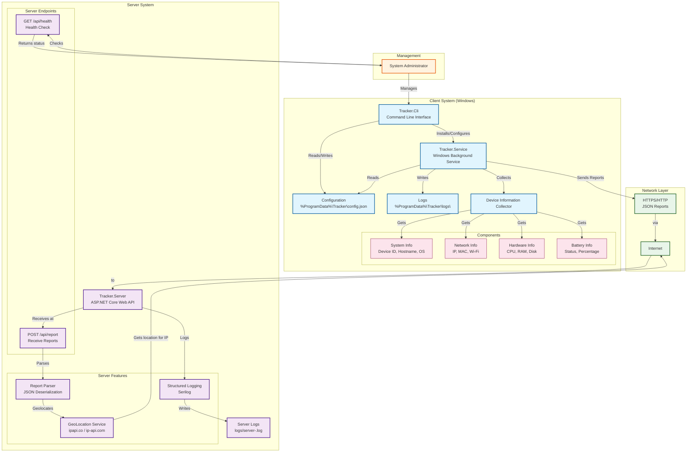

# Laptop Tracker

> ⚠️ **DISCLAIMER**: This software is provided for **educational and ethical use only**. 
> 
> - Only use this tool on devices you own or have explicit written permission to monitor.
> - Always inform users if you are tracking devices in a shared environment.
> - Respect privacy laws and regulations in your jurisdiction (GDPR, CCPA, PIPEDA, etc.).
> - The author assumes **NO responsibility** for any misuse, illegal activities, or damages caused by this software.
> - By using this software, you agree that you are solely responsible for ensuring compliance with all applicable laws.

A Windows service that periodically reports device information to a configurable webhook endpoint. Ideal for inventory management, device tracking, and IT asset monitoring.

## Features

### Core Functionality
- Windows Service with automatic startup
- Configurable reporting interval (default: 300 seconds / 5 minutes)
- HTTPS JSON reporting with retry logic
- Automatic retries with exponential backoff
- Comprehensive device information collection

### Device Information Collected
- **System Info**: Device ID, Hostname, Username, OS Version
- **Network**: Public IP, Local IP, MAC Address, Wi-Fi SSID
- **Location**: Approximate Geo-location (via IP geolocation)
- **Hardware**: CPU, RAM, Disk Usage
- **Battery**: Status, Percentage, Charging State

### Management Features
- CLI management utility with full command support
- Detailed structured logging with Serilog
- Configurable settings stored in JSON
- Test mode for configuration validation
- Service status monitoring

## Projects

| Project | Description |
|---------|-------------|
| **Tracker.Service** | Windows Background Service that runs continuously and reports at configured intervals |
| **Tracker.Cli** | Command-line utility for installation, configuration, and management |
| **Tracker.Shared** | Shared models, DTOs, and utilities used across projects |
| **Tracker.Server** | Optional webhook receiver that can process, log, and geolocate incoming reports |

## Requirements

- Windows 10/11 or Windows Server 2016+
- .NET 10.0 Runtime
- Administrator privileges (for service installation)

## Quick Start

### 1. Build the Projects
```bash
dotnet build -c Release
```

### 2. Configure Webhook
```bash
Tracker.Cli.exe set webhook https://your-server.com/api/report
```

### 3. Install the Service (Run as Administrator)
```bash
Tracker.Cli.exe install
```

### 4. Start the Service (Run as Administrator)
```bash
Tracker.Cli.exe start
```

### 5. Verify Status
```bash
Tracker.Cli.exe status
```

## Commands

### Service Management
| Command | Description |
|---------|-------------|
| `Tracker.Cli.exe install` | Install Windows service (requires admin) |
| `Tracker.Cli.exe uninstall` | Uninstall Windows service (requires admin) |
| `Tracker.Cli.exe start` | Start the service (requires admin) |
| `Tracker.Cli.exe stop` | Stop the service (requires admin) |
| `Tracker.Cli.exe restart` | Restart the service (requires admin) |
| `Tracker.Cli.exe status` | Check service status |

### Configuration
| Command | Description |
|---------|-------------|
| `Tracker.Cli.exe config` | View current configuration |
| `Tracker.Cli.exe set webhook <url>` | Set reporting endpoint |
| `Tracker.Cli.exe set interval <seconds>` | Set reporting interval (minimum 30s) |

### Diagnostics
| Command | Description |
|---------|-------------|
| `Tracker.Cli.exe run-once` | Run a single report (foreground) |
| `Tracker.Cli.exe test` | Test configuration and connection |
| `Tracker.Cli.exe version` | Display version information |
| `Tracker.Cli.exe help` | Show help message |

### Examples
```bash
# Install and start the service (Run as Administrator)
Tracker.Cli.exe install
Tracker.Cli.exe start

# Configure the webhook endpoint
Tracker.Cli.exe set webhook https://myserver.com/api/report

# Set reporting interval to 2 minutes
Tracker.Cli.exe set interval 120

# Run a single test report
Tracker.Cli.exe run-once

# Test the configuration
Tracker.Cli.exe test

# Check service status
Tracker.Cli.exe status

# View current configuration
Tracker.Cli.exe config

# Stop and uninstall
Tracker.Cli.exe stop
Tracker.Cli.exe uninstall
```

## Configuration

Configuration is stored in `%ProgramData%\Tracker\config.json`:

```json
{
  "WebhookUrl": "https://your-server.com/api/report",
  "ReportIntervalSeconds": 300,
  "RetryCount": 3,
  "RetryDelaySeconds": 5,
  "EnableGeoLocation": true,
  "EnableBatteryMonitoring": true,
  "EnableDiskMonitoring": true
}
```

### Configuration Options

| Option | Description | Default |
|--------|-------------|---------|
| `WebhookUrl` | Endpoint to send reports to | `http://localhost:5001/api/report` |
| `ReportIntervalSeconds` | How often to send reports | `300` (5 minutes) |
| `RetryCount` | Number of retry attempts on failure | `3` |
| `RetryDelaySeconds` | Delay between retries | `5` |
| `EnableGeoLocation` | Enable IP geolocation | `true` |
| `EnableBatteryMonitoring` | Collect battery information | `true` |
| `EnableDiskMonitoring` | Collect disk usage information | `true` |

## Server Setup

### Quick Start
```bash
cd Tracker.Server
dotnet run
```

The server will listen on port 80 by default.

### Endpoints
- `GET /api/health` - Health check
- `POST /api/report` - Receive device reports

### Sample Response
```json
{
  "status": "success",
  "message": "Device report logged successfully",
  "timestamp": "2026-06-27T17:22:54.7998987Z",
  "deviceId": "DESKTOP-6FS8G0K",
  "city": "Mumbai",
  "latitude": 19.0760,
  "longitude": 72.8777,
  "geo_source": "server"
}
```

## Logging

### Service Logs
Located at: `%ProgramData%\Tracker\logs\service-.log`

### Server Logs
Located at: `logs/server-.log`

### View Logs
```bash
# View service logs
type "%ProgramData%\Tracker\logs\service-.log"

# View server logs
type "logs\server-.log"

# Tail logs (PowerShell)
Get-Content "%ProgramData%\Tracker\logs\service-.log" -Wait
```

### Log Levels
- **Information**: Normal operations
- **Warning**: Recoverable issues
- **Error**: Failures requiring attention
- **Debug**: Detailed debugging (enable with `Log.Debug`)

## Architecture



## Security Considerations

1. **HTTPS**: Always use HTTPS for production deployments
2. **Authentication**: Implement API keys or JWT for production servers
3. **Data Privacy**: Be mindful of what data you collect
4. **Network**: Run the server behind a firewall
5. **Logging**: Avoid logging sensitive information (passwords, tokens, etc.)

## Development

### Build All Projects
```bash
dotnet build -c Release
```

### Build Individual Projects
```bash
# Build shared library first
dotnet build Tracker.Shared -c Release

# Build service
dotnet build Tracker.Service -c Release

# Build CLI
dotnet build Tracker.Cli -c Release

# Build server
dotnet build Tracker.Server -c Release
```

### Publish Service
```bash
dotnet publish Tracker.Service -c Release -r win-x64 --self-contained
```

### Run Tests
```bash
dotnet test
```

## Troubleshooting

### Service Won't Start
- Check logs in `%ProgramData%\Tracker\logs\service-.log`
- Verify webhook URL is accessible
- Ensure sufficient permissions (run as administrator)
- Check if another service is using the same port

### Reports Not Being Received
- Verify server is running
- Check network connectivity
- Validate webhook URL format
- Check server logs for errors
- Run `Tracker.Cli.exe test` to verify connectivity

### Geo-location Not Working
- Ensure public IP is accessible
- Check if IP is private/local (127.0.0.1, 192.168.x.x, 10.x.x.x)
- Verify geo-service providers are reachable
- Check firewall settings
- Try `Tracker.Cli.exe run-once` to see detailed output

### Installation Failed
- Run Command Prompt as Administrator
- Ensure .NET Runtime is installed
- Check if service already exists: `sc query LaptopTracker`
- Check the error message for specific details

### Configuration Not Loading
- Verify config file exists at `%ProgramData%\Tracker\config.json`
- Check file permissions
- Validate JSON format
- Run `Tracker.Cli.exe config` to see current settings

## Uninstall

### Stop and Remove Service
```bash
Tracker.Cli.exe stop
Tracker.Cli.exe uninstall
```

### Remove Configuration (optional)
```bash
rmdir /s "%ProgramData%\Tracker"
```

## License

MIT License - See [LICENSE](LICENSE) file for details.

---

## ⚠️ IMPORTANT LEGAL NOTICE

**By downloading, installing, or using this software, you acknowledge and agree that:**

1. You will use this software **only** on devices you own or have explicit written permission to monitor.
2. You will comply with all applicable local, state, national, and international laws including but not limited to:
   - General Data Protection Regulation (GDPR) in the EU
   - California Consumer Privacy Act (CCPA) in the US
   - Personal Information Protection and Electronic Documents Act (PIPEDA) in Canada
   - Any other relevant privacy and data protection laws
3. You will not use this software for any malicious, illegal, or unauthorized purposes including:
   - Stalking, harassment, or surveillance without consent
   - Corporate espionage or industrial spying
   - Tracking individuals without their knowledge and consent
   - Any activity that violates human rights or privacy rights
4. You will inform any users if you are monitoring devices in a shared environment.
5. You will implement appropriate security measures to protect collected data.
6. You will delete collected data when no longer needed for legitimate purposes.
7. The author is **not responsible** for any misuse, data breaches, legal issues, or damages.
8. You assume **full responsibility** for how you use this software and its outcomes.
9. No warranty or guarantee is provided - use at your own risk.

📌 **Remember**: Just because you *can* track devices doesn't mean you *should* without proper consent and legal compliance. 

**Always prioritize privacy, consent, and ethical considerations.**

---

*Made with ❤️ for educational purposes. Use responsibly.*
