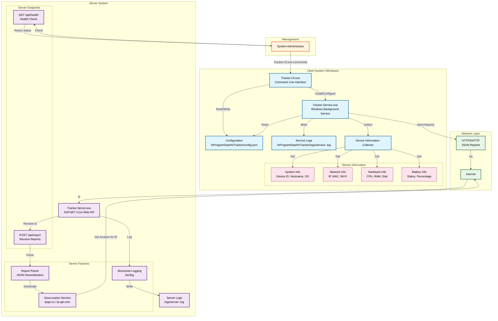
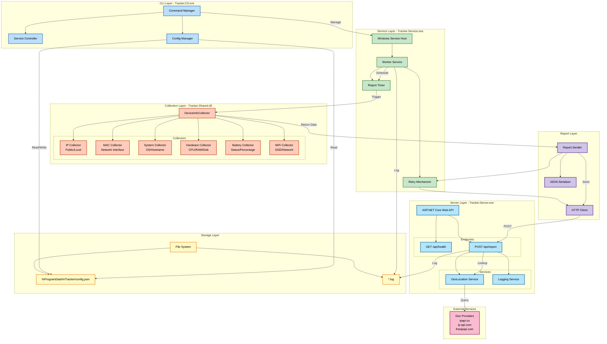
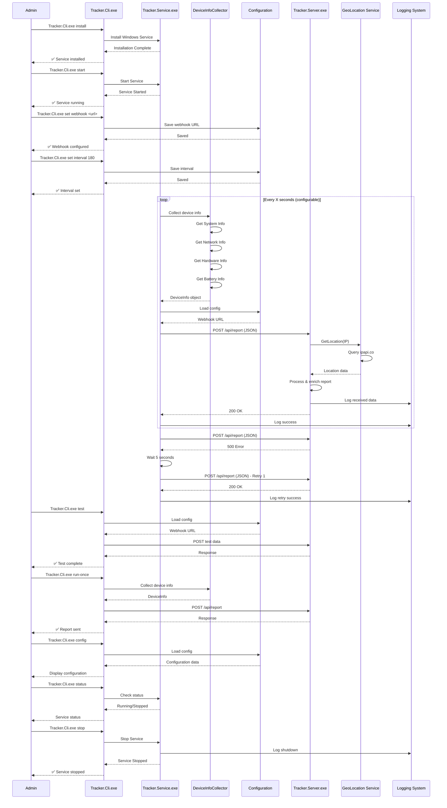

Here's the updated Mermaid architecture diagrams with correct executable names and improved styling:

**Architecture Overview Diagram:**

**Component Architecture Diagram:**

**Sequence Diagram:**

